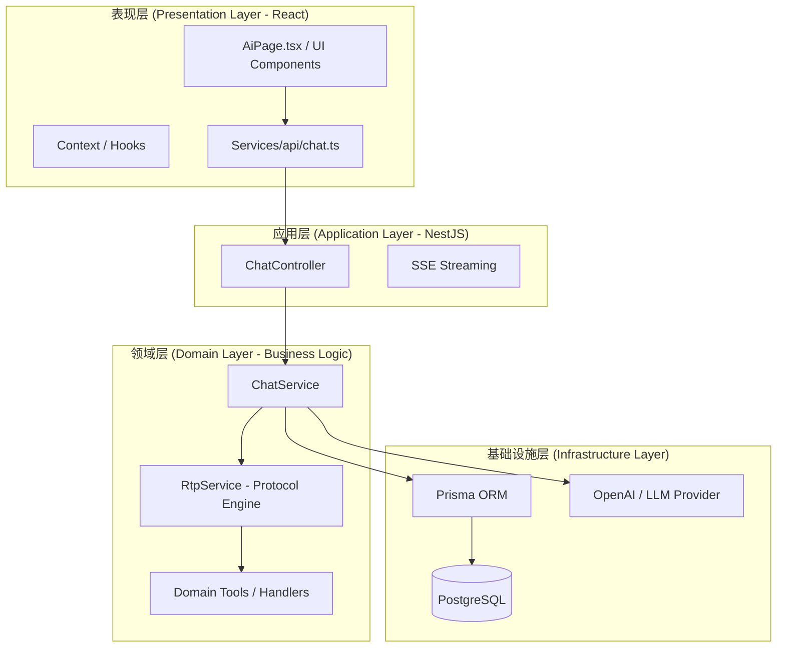
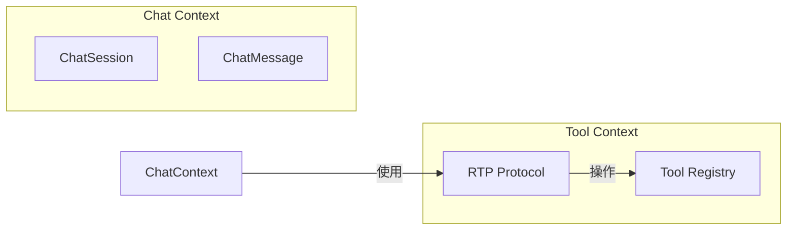

# 架构设计文档 (Architecture Design)

本文档描述了系统的整体架构、分层模型以及核心组件之间的关系。

## 1. 系统逻辑架构 (Layered Architecture)

系统采用经典的四层架构模式，并结合 DDD (领域驱动设计) 的思想进行职责划分。

## 2. RTP 协议模型 (Real-time Tool Protocol)

RTP 协议基于 JSON-RPC 2.0，旨在解耦 AI 模型与具体的工具实现。

### 核心组件
- **RtpService**: 协议引擎，负责工具注册、发现和调度。
- **ToolDefinition**: 采用 JSON Schema 定义工具的输入/输出契约。
- **JsonRpc Handler**: 处理符合规范的请求与响应。

### 上下文映射 (Context Mapping)

## 3. 物理部署架构 (Deployment)

系统采用 Monorepo 结构，支持独立构建与部署。

- **Frontend**: Vite 构建的静态资源，部署于 Nginx 或 Vercel。
- **Backend**: Node.js (NestJS) 运行时，运行于 Docker 容器。
- **Database**: PostgreSQL 关系型数据库。
- **External**: OpenAI API 外部服务。

## 4. 非功能性设计

- **实时性**: 通过 SSE (Server-Sent Events) 实现低延迟的流式反馈。
- **扩展性**: RTP 协议允许在不修改 Chat 核心逻辑的情况下，通过添加新的 Tool Handler 扩展业务能力。
- **一致性**: 采用数据库先行策略，确保所有 AI 交互记录均持久化，支持历史回溯。
- **鲁棒性**: 引入断连自动清理与流式异常捕获机制。
