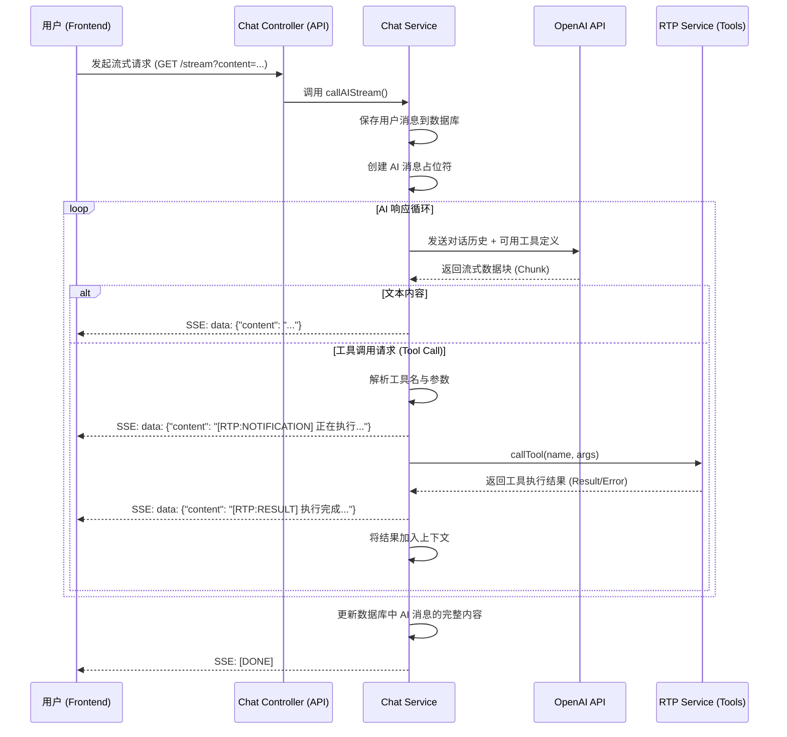
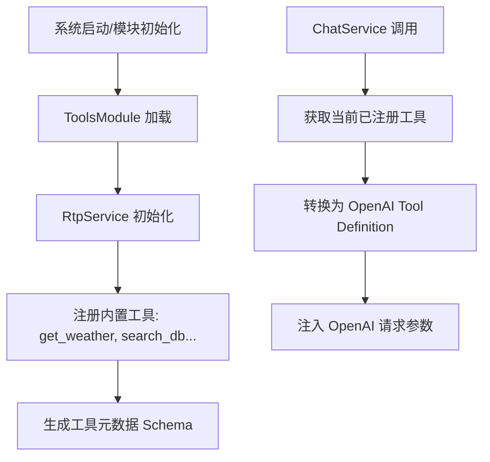
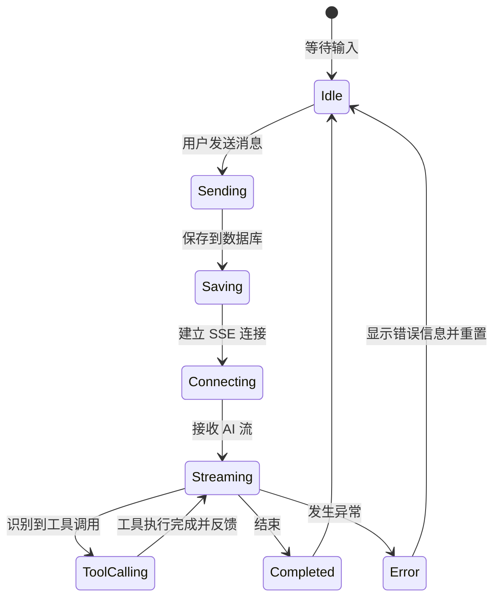

# 业务流程图 (Business Flow)

本文档描述了 AI 聊天系统及 RTP (Real-time Tool Protocol) 协议的核心业务流程。

## 1. 端到端聊天与工具调用流程

该流程展示了用户从发送消息到接收 AI 响应（包括中间可能发生的工具调用）的全过程。

## 2. RTP 工具注册与发现流程

RTP 协议允许动态扩展 AI 的能力。

## 3. 异常处理与状态流转

