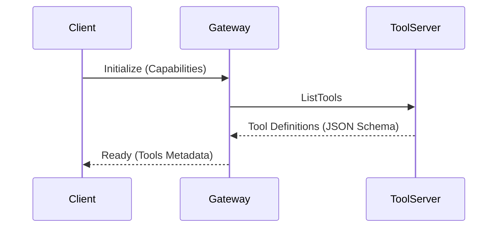
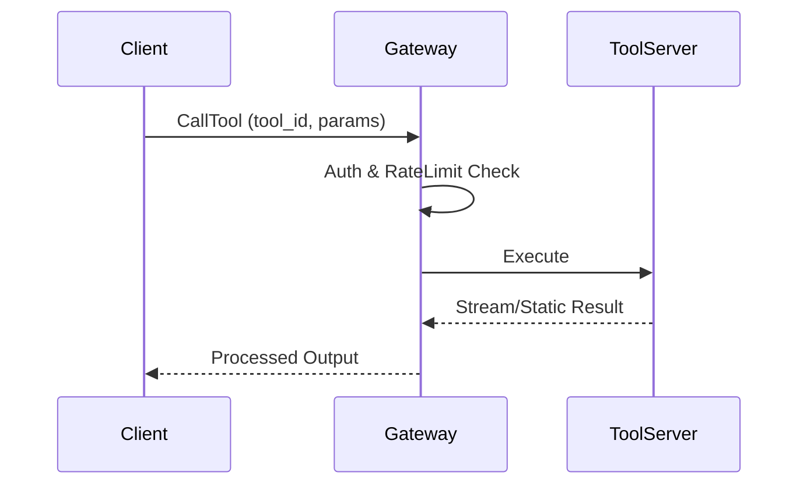

# AI 实时工具调用协议 (RTP - Real-time Tool Protocol) 产品需求文档 (PRD)

## 1. 业务愿景与目标

### 1.1 背景
当前 AI 应用（Agent/Chatbot）与外部世界的交互往往受限于硬编码的 API 集成，缺乏标准化的协议导致：
- **集成成本高**：每个新工具都需要手写适配逻辑。
- **扩展性差**：模型无法在运行时动态发现和调用新能力。
- **上下文隔离**：数据源与模型之间缺乏统一的上下文交换标准。

### 1.2 业务目标
构建一套类似 MCP (Model Context Protocol) 的轻量级、标准化协议，旨在：
- **标准化交互**：定义模型与工具服务器之间的通信契约。
- **实时性增强**：支持流式响应与长连接，确保工具执行的实时反馈。
- **生态互联**：允许第三方开发者快速接入工具，形成 AI 能力插件市场。

---

## 2. 领域模型设计 (DDD)

根据领域驱动设计，我们将系统划分为以下核心域：

### 2.1 核心域：协议引擎 (Protocol Engine)
- **聚合根：Tool (工具)**
  - **实体**：Definition (定义), Schema (输入输出规范), Handler (处理器)。
  - **值对象**：ToolId, Version, Metadata (描述、示例)。
- **聚合根：Session (会话)**
  - **状态机**：Initialized -> Handshaking -> Active -> Closed。
  - **能力**：管理模型与工具服务器之间的长连接上下文。

### 2.2 支撑域：工具治理 (Governance)
- **限界上下文**：权限审计、流量配额、安全沙箱。
- **关键概念**：Capability (能力声明), Policy (安全策略)。

### 2.3 通用域：基础设施
- **通信适配器**：WebSocket, HTTP/2, gRPC。

---

## 3. 系统边界与职责治理

基于高内聚低耦合原则，定义以下三大系统边界：

| 组件 | 业务职责 | 数据主权 |
| :--- | :--- | :--- |
| **Client (AI Agent)** | 发起请求、处理模型推理、管理用户交互。 | 用户意图数据、会话历史。 |
| **RTP Gateway (网关)** | 协议翻译、工具路由、权限校验、审计记录。 | 路由表、访问日志、密钥。 |
| **Tool Server (执行端)** | 业务逻辑执行、外部 API 聚合、结果结构化。 | 业务领域数据。 |

---

## 4. 关键流程梳理

### 4.1 工具发现与握手 (Discovery)
模型启动时，通过 `Initialize` 指令获取可用工具列表。


### 4.2 实时调用流 (Execution Flow)


---

## 5. 协议架构方案 (RTP Spec)

### 5.1 传输层
- **主要协议**：JSON-RPC 2.0 over HTTP/SSE 或 WebSocket。
- **鉴权**：支持 Bearer Token 或 mTLS。

### 5.2 核心指令集
- `tools/list`: 获取可用工具。
- `tools/call`: 执行指定工具。
- `resources/read`: 获取静态/动态上下文资源。
- `prompts/get`: 获取预定义的模型提示词模板。

---

## 6. 非功能性需求与安全边界

### 6.1 安全边界治理
- **防腐层 (ACL)**：网关必须对 Tool Server 返回的数据进行脱敏和格式校验，防止注入攻击。
- **沙箱化**：本地执行的工具必须在容器化或 WASM 沙箱中运行。
- **幂等性**：所有写操作工具必须支持 `request_id` 幂等校验。

### 6.2 质量指标 (SLI/SLO)
- **延迟**：95% 的工具调用延迟 < 200ms（不含业务执行时间）。
- **可用性**：协议网关可用性 99.99%。
- **可观测性**：全链路 Trace ID 追踪，集成 Prometheus 指标。

---

## 7. 演进路线图 (Roadmap)

- **MVA (最小可行架构)**：
  - 实现基于 HTTP/SSE 的单向工具调用。
  - 支持静态 JSON Schema 定义。
- **Phase 2 (实时性增强)**：
  - 引入 WebSocket 全双工通信。
  - 支持流式资源获取 (Resources Streaming)。
- **Phase 3 (生态与治理)**：
  - 动态插件加载机制。
  - 完善的开发者 SDK (TS/Python)。
  - 多租户隔离与精细化权限模型。

---

## 8. 架构决策记录 (ADR)

### ADR 001: 核心通信协议选择 JSON-RPC 2.0

- **上下文 (Context)**
  AI 工具调用（Tool Calling）本质上是远程过程调用（RPC）。我们需要一种协议，既能描述请求与响应，又能支持异步通知（如执行进度、状态更新），且必须是跨平台、易于序列化的。

- **对比方案 (Alternatives)**
  - **RESTful API**: 过于强调资源实体，对于“执行动作”这类行为描述不够直观；状态码与业务逻辑解耦较难；不支持原生批量请求。
  - **gRPC**: 性能极高但调试成本高，需要预编译 Proto 文件，对动态发现工具（Dynamic Discovery）不够友好。
  - **GraphQL**: 适合复杂查询，但对于简单的命令式工具调用显得过于笨重。

- **决策理由 (Rationale)**
  - **传输无关性**: JSON-RPC 2.0 可以在 HTTP、WebSocket、SSE 甚至标准输入输出（stdio）上运行，灵活性极高。
  - **原生支持异步通知**: `Notification` 类型允许 Tool Server 在不被请求的情况下推送数据（如日志、进度条）。
  - **轻量与可扩展**: 协议格式极其精简（id, method, params, result/error），通过 `params` 可以轻松扩展复杂的业务参数。
  - **与 LLM 契合度**: 主流 LLM（如 GPT-4, Claude 3.5）生成的 Tool Call 结构本身就与 JSON-RPC 高度相似。

- **影响 (Consequences)**
  - 开发者可以利用成熟的 JSON-RPC 库快速构建 Tool Server。
  - 前端可以通过单一长连接处理多个工具的并发调用（Batching）。

### ADR 002: 引入 SSE (Server-Sent Events) 支持异步流
- **背景**：工具执行可能耗时较长。
- **理由**：相比 WebSocket 更轻量，易于穿透防火墙，适合流式输出执行进度。

---

## 9. 附录：JSON-RPC 2.0 消息示例

### 9.1 工具执行请求 (Client -> Gateway)
```json
{
  "jsonrpc": "2.0",
  "method": "tools/call",
  "params": {
    "name": "fetch_realtime_stock",
    "arguments": {
      "symbol": "AAPL"
    }
  },
  "id": "req-001"
}
```

### 9.2 工具执行成功响应 (Tool Server -> Client)
```json
{
  "jsonrpc": "2.0",
  "result": {
    "content": [
      {
        "type": "text",
        "text": "Current price for AAPL is $185.92 (Up 1.2%)"
      }
    ]
  },
  "id": "req-001"
}
```

### 9.3 执行进度通知 (Notification - Tool Server -> Client)
```json
{
  "jsonrpc": "2.0",
  "method": "notifications/progress",
  "params": {
    "progress": 50,
    "status": "Fetching data from NYSE API..."
  }
}
```
