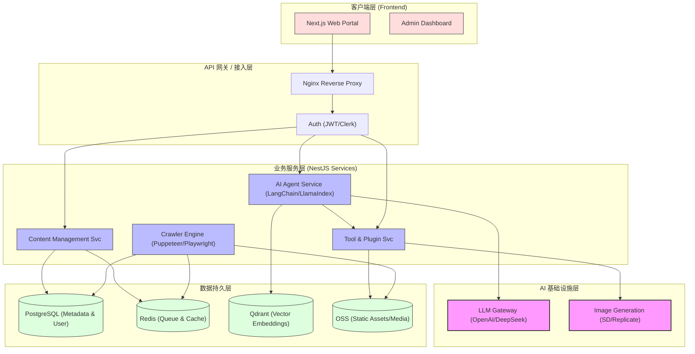
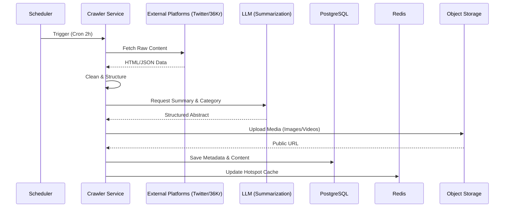
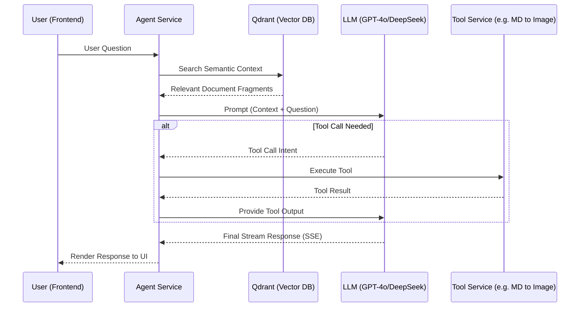

# AI树洞 (AICave) 系统架构设计文档 (Architecture)

## 1. 架构概述

AI树洞采用典型的**分层分布式架构**，旨在支撑高频的内容采集、多维度的内容分发以及实时的 AI 智能体交互。系统核心遵循“高内聚低耦合”原则，将内容爬取、AI 推理与业务逻辑进行物理与逻辑上的解耦。

## 2. 系统架构图 (System Architecture)

## 3. 技术选型 (Technology Stack)

### 3.1 前端 (Frontend)
- **框架**：Next.js 14+ (App Router) - 利用 SSR 提升 SEO 友好度，确保资讯内容被搜索引擎收录。
- **UI 组件库**：Tailwind CSS + Shadcn/ui - 打造现代化的极简 UI。
- **状态管理**：Zustand / TanStack Query - 处理复杂的异步数据获取与本地状态。
- **交互**：Framer Motion - 提升多媒体展示层的动效体验。

### 3.2 后端 (Backend)
- **框架**：NestJS - 提供高度模块化的架构，便于扩展 Crawler 和 Agent 模块。
- **语言**：TypeScript - 保证全栈类型安全。
- **定时任务**：@nestjs/schedule - 处理资讯的定时采集任务。
- **通信**：Socket.io / SSE - 用于 Agent 对话的流式响应。

### 3.3 AI 与数据 (AI & Data)
- **LLM**：OpenAI GPT-4o (复杂推理), DeepSeek V3 (高性价比处理)。
- **生图**：Stable Diffusion WebUI API / Replicate。
- **向量数据库**：Qdrant - 存储文章嵌入向量，支持 RAG 语义搜索。
- **主数据库**：PostgreSQL + Prisma ORM - 管理结构化内容、用户信息与配置。

### 3.4 基础设施 (Infrastructure)
- **容器化**：Docker + Kubernetes (或 Docker Compose) - 保证环境一致性。
- **存储**：阿里云 OSS / AWS S3 - 托管大规模多媒体资源。
- **缓存**：Redis - 存储热点资讯、会话状态及采集队列。

## 4. 核心模块设计

### 4.1 内容采集引擎 (Crawler Engine)
- **策略模式**：针对不同平台（Twitter, 36Kr, 知乎）实现不同的 `Strategy`。
- **反爬策略**：集成 Puppeteer / Playwright 模拟真实浏览器环境，结合代理池绕过反爬机制。
- **流水线处理**：采集 -> 结构化清洗 -> AI 摘要生成 -> 向量化存储。

### 4.2 智能体交互系统 (Agent System)
- **插件机制**：基于工具调用（Tool Calling）协议，Agent 可调用“MD转图片”、“站内搜索”等内部工具。
- **上下文管理**：利用 Redis 存储短期会话，Qdrant 提供长期知识库。

## 5. 数据流向 (Data Flow)

### 5.1 资讯更新流 (News Update Flow)

### 5.2 智能体问答流 (Agent Q&A Flow)

## 6. 非功能性架构决策 (ADR)

- **ADR-001: 采用 SSE 而非 WebSocket 处理对话**：
  - **背景**：Agent 对话多为单向流式输出。
  - **决策**：优先使用 SSE (Server-Sent Events)。
  - **理由**：更轻量，对 HTTP 负载均衡更友好，自动支持重连。
- **ADR-002: 向量化前置处理**：
  - **决策**：所有收录的文章在入库时必须进行 Embedding。
  - **理由**：为后续的“AI 语义搜索”和“相关内容推荐”奠定基础。

## 7. 安全与监控

- **边界保护**：所有 API 接口实施 Rate Limiting，防止恶意抓取。
- **可观测性**：集成 Prometheus + Grafana 监控采集成功率与 AI 接口延迟。
- **内容合规**：接入敏感词过滤服务，确保 AI 生成内容符合监管要求。

## 8. 架构批判性审查与演进 (Critical Review & Evolution)

### 8.1 潜在风险分析
- **资源争抢风险**：当前爬虫引擎与业务 API 同进程部署，高负载抓取可能阻塞用户请求。
- **LLM 依赖过重**：同步链路中强依赖外部 API，缺乏降级方案。
- **状态管理复杂度**：随着 Agent 工具集增加，多步对话的中间状态维护将面临挑战。

### 8.2 演进建议 (Roadmap)
- **容器化隔离**：短期内将 `Crawler Engine` 迁移至独立的 Docker 容器，通过 Redis List/BullMQ 进行任务分发。
- **引入本地 SLM**：引入本地运行的轻量级模型（如 Qwen-7B）处理非核心的文本清洗工作，降低成本并提升确定性。
- **冷热数据分离**：PostgreSQL 仅保留近期热点资讯，历史数据定期归档至低成本存储或压缩表中。
- **增加分布式追踪**：集成 OpenTelemetry，覆盖从采集起点到前端响应的全链路 Trace。
