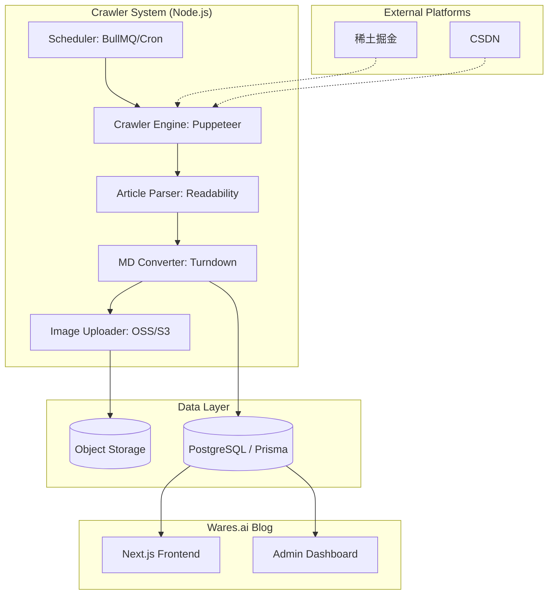
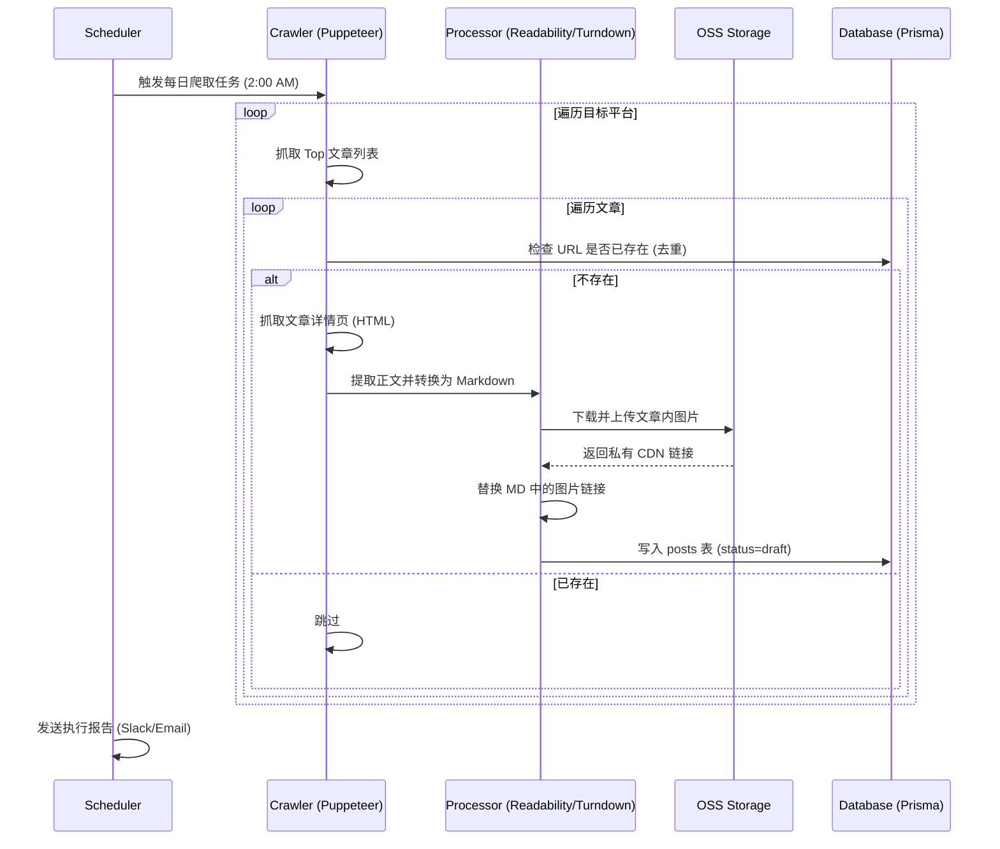
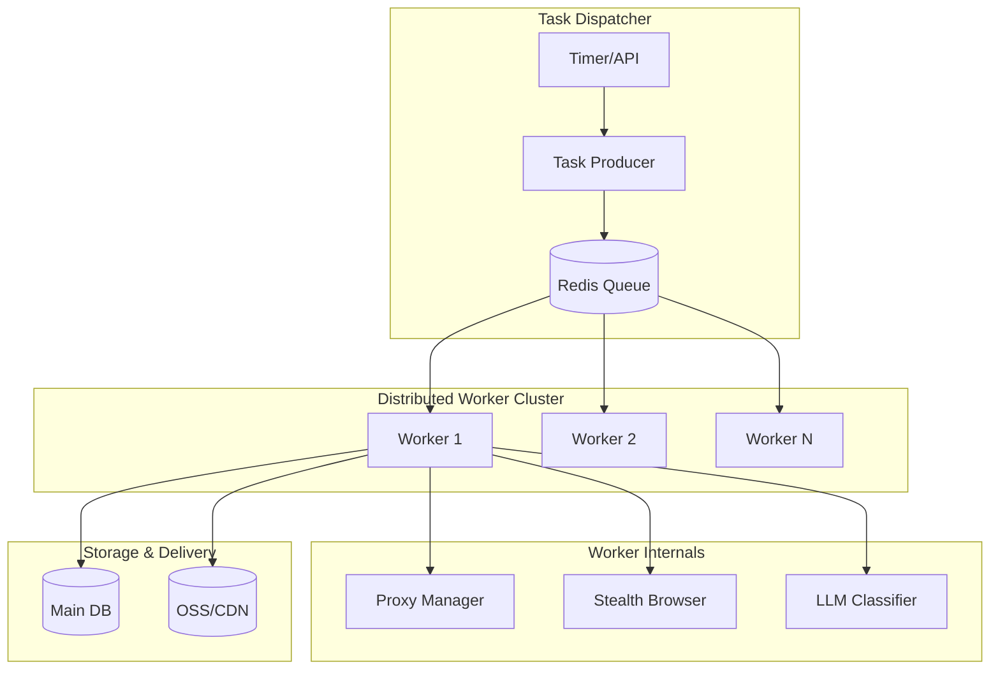

# PRD: 博客内容自动化爬取与分发系统

## 1. 业务背景
为了保持 Wares.ai 博客的内容活力，提升 SEO 排名并为用户提供持续的高质量技术资讯，需要建立一套自动化的内容获取机制。该系统将从主流技术社区（如稀土掘金、CSDN 等）爬取高热度文章，经过清洗、转换后自动发布或存入草稿箱。

## 2. 核心目标
- **自动化内容获取**：每日定时爬取指定平台的 Top 榜单文章。
- **数据清洗与转化**：去除平台噪声（广告、外链、样式），保留纯净的 Markdown 内容。
- **自动入库**：与当前博客系统的数据库无缝集成。
- **合规性管理**：保留原文链接，尊重版权，支持设置发布状态为“草稿”供人工审核。

## 3. 功能需求

### 3.1 爬取模块 (Crawler Service)
- **目标平台**：首期支持稀土掘金（热榜）、CSDN（每日精选）。
- **触发机制**：每日凌晨 2:00 自动执行。
- **爬取指标**：点赞数 > 100 或 收藏数 > 50 的技术文章。
- **反爬策略**：使用代理池、设置合理的 Request Interval、模拟浏览器 Header。

### 3.2 清洗与转换模块 (Processor Service)
- **正文提取**：利用 Readability 算法或 CSS 选择器精准提取文章正文。
- **格式转换**：将 HTML 转换为标准的 Markdown 格式（使用 Turndown）。
- **图片处理**：
  - 识别文章内的图片。
  - 将图片下载并上传至私有对象存储（OSS/S3），防止图片防盗链导致失效。
- **元数据提取**：提取标题、摘要（excerpt）、封面图（coverUrl）、标签（tags）。

### 3.3 数据持久化 (Storage Service)
- **去重校验**：基于原文 URL 或内容哈希值，避免重复入库。
- **自动关联**：根据关键词自动分配到现有的博客分类（Category）。
- **状态控制**：默认进入 `draft` 状态，支持配置直接进入 `published`。

## 4. 技术方案与架构设计

### 4.1 技术选型

| 维度 | 选型 | 理由 |
| :--- | :--- | :--- |
| **语言环境** | Node.js (TypeScript) | 与现有 API 项目保持一致，生态丰富。 |
| **爬取引擎** | **Puppeteer** | 支持无头浏览器渲染，可处理掘金/CSDN 的动态加载和反爬验证。 |
| **解析工具** | **@mozilla/readability** | 业界标准，自动识别网页主体，过滤无关噪声（广告、侧边栏）。 |
| **格式转换** | **Turndown** | 将 HTML 完美转换为 Markdown，支持插件扩展。 |
| **任务调度** | **BullMQ + Redis** | 支持任务持久化、失败重试、并发控制，比 simple cron 更稳健。 |
| **图片存储** | **AWS S3 / 阿里云 OSS** | 解决外部图片防盗链问题，确保持久可用。 |
| **数据库** | **Prisma (PostgreSQL)** | 复用现有数据库模型，无缝集成。 |

### 4.2 系统架构图



### 4.3 业务流程图



## 5. 架构审查与风险治理 (Architectural Review)

作为架构师，对本方案进行深度审计后，识别出以下潜在风险及优化建议：

### 5.1 性能与资源权衡
- **批判点**：对于每日仅一次的任务，引入 **BullMQ + Redis** 可能存在过度设计。
- **治理**：若当前基础设施未部署 Redis，初期建议采用简单的 **Node-cron + 数据库任务表** 记录状态。只有当爬取源扩展至 10+ 且需要高并发处理时，才切换至消息队列。
- **批判点**：**Puppeteer** 资源消耗极大（内存/CPU）。
- **治理**：优先采用 **API-First 策略**。例如掘金热榜有公开的 JSON API，直接通过 `axios` 请求效率提升 10 倍以上。仅在处理复杂反爬（如滑动验证）或必须模拟渲染时才调用 Puppeteer。

### 5.2 数据质量与一致性
- **批判点**：**Turndown** 转换可能丢失复杂的 Markdown 语法（如嵌套表格、数学公式、自定义代码块高亮）。
- **治理**：需引入 **清洗白名单机制**，针对不同平台定制 CSS 选择器，保留关键 HTML 标签而非一刀切转换。
- **批判点**：**图片转储** 存在带宽与存储成本风险。
- **治理**：引入 **图片延迟处理/代理模式**。对于某些不设防且稳定的 CDN，可直接引用；仅对防盗链严格的平台执行 OSS 转储。

### 5.3 SEO 与版权风险 (核心风险)
- **批判点**：**重复内容 (Duplicate Content)** 会导致 Google/百度降低博客权重。
- **治理**：
    1.  在 `posts` 表中增加 `canonical_url` 字段，在 HTML 的 `<head>` 中输出该链接，告知搜索引擎权重归属原文。
    2.  增加 **内容重组 (Re-writing) 逻辑**。利用大模型（LLM）对爬取内容的标题和摘要进行改写，提升原创度。
- **批判点**：单纯的“链接声明”可能无法完全规避法律风险。
- **治理**：系统应支持 **一键下架 (Takedown)** 功能，并在前台提供明显的侵权申诉入口。

### 5.4 系统稳定性
- **批判点**：爬取逻辑与主 API 进程耦合。
- **治理**：爬取系统应作为 **独立 Worker 进程** 运行，通过环境变量或独立配置文件管理，确保其崩溃不影响主站访问。

## 6. 核心逻辑实现要点
- **可扩展性**：支持快速接入新的爬取源。
- **稳定性**：单篇解析失败不应影响整体流程。
- **版权合规**：文章末尾强制追加“原文链接”及“作者信息”。

## 7. 规模化扩展策略 (Scalability Strategy)

如果后续需要从每日抓取 5-10 篇扩展至每日抓取成百上千篇，系统需进行以下技术演进：

### 7.1 分布式爬取架构
- **节点水平扩展**：将爬取逻辑拆分为独立的 **Crawler Worker**。通过 Docker 容器化部署，利用 K8s 或 Serverless (如 AWS Lambda) 根据任务量动态增加节点。
- **消息驱动**：正式启用 **BullMQ + Redis**。
    - **Producer**：负责发现 URL 并推入队列。
    - **Consumer**：多个独立 Worker 从队列中获取任务并执行抓取。

### 7.2 智能反爬治理
- **代理池 (Proxy Pool)**：引入付费的高质量动态住宅代理（如 Bright Data），实现请求 IP 的实时轮换，规避大规模爬取时的封禁。
- **指纹伪装**：使用 `puppeteer-extra-plugin-stealth` 伪装浏览器指纹，模拟真实用户交互（如随机滚动、点击）。

### 7.3 自动化内容治理 (AI-Powered)
- **自动分类与打标**：当文章数量激增时，人工分类不再可行。
    - 接入 **LLM (OpenAI/DeepSeek)**：自动分析正文内容，归纳核心标签（Tags）并分配至最匹配的分类（Category）。
- **质量分级 (Quality Scoring)**：建立自动评分模型。基于文章长度、代码占比、图片密度等维度，优先发布高分内容，低分内容直接过滤。

### 7.4 存储与分发优化
- **增量更新策略**：引入 **ETag/Last-Modified** 校验。对于已抓取的文章，仅在其内容发生变更时才重新解析，节省带宽与计算资源。
- **读写分离**：当爬取入库频率极高时，数据库需配置读写分离，确保后台爬取不影响前台用户的访问性能。

### 7.5 监控与预警
- **抓取看板**：监控抓取成功率、解析成功率、代理消耗量。
- **自动熔断**：当某个平台连续出现 403 或验证码时，自动熔断该源的爬取，防止账号/IP 被永久封禁。

## 8. 规模化架构示意图



## 9. 项目目录结构建议 (Project Structure)

为了符合现有的 NestJS 架构并确保爬取逻辑的内聚性，建议在 `apps/api` 中按以下结构组织代码：

```text
apps/api/src/modules/crawler/
├── crawler.module.ts          # 模块入口，注册定时任务或队列
├── crawler.service.ts         # 核心逻辑：控制爬取流、去重校验
├── crawler.constants.ts       # 配置常量（如爬取阈值、平台 URL）
├── strategies/                # 平台爬取策略（策略模式）
│   ├── base.strategy.ts       # 定义爬取接口抽象类
│   ├── juejin.strategy.ts     # 稀土掘金爬取实现
│   └── csdn.strategy.ts       # CSDN 爬取实现
├── transformers/              # 内容清洗与转换工具
│   ├── readability.helper.ts  # 封装 Readability 提取正文
│   ├── turndown.helper.ts     # 封装 HTML 转 Markdown 逻辑
│   └── oss-uploader.service.ts # 图片下载并上传至 OSS 的逻辑
└── dto/                       # 数据传输对象
    └── crawled-post.dto.ts    # 爬取结果的标准定义
```

### 目录说明：
- **strategies/**：采用策略模式，方便后续横向扩展新的平台（如微信公众号、知乎），无需修改核心逻辑。
- **transformers/**：将复杂的转换逻辑抽离，便于独立测试（单元测试验证 HTML -> MD 的准确性）。
- **crawler.service.ts**：作为门面（Facade），协调策略抓取、数据转换、图片处理及最终的 Prisma 入库。

## 10. 项目里程碑 (Project Milestones)

根据功能优先级与技术复杂度，建议分四个阶段推进项目落地：

### M1: 基础架构与 MVP 验证 (第 1 周)
- **目标**：跑通“抓取-入库”最小闭环。
- **关键交付物**：
    - 完成 `crawler` 模块骨架及 `base.strategy` 抽象定义。
    - 实现 **稀土掘金 (API 模式)** 的基础抓取策略。
    - 完成数据库去重校验逻辑。
    - **里程碑点**：手动触发脚本，能将掘金热榜标题抓取并存入数据库。

### M2: 内容深度清洗与媒体处理 (第 2 周)
- **目标**：实现高质量内容转化与图片防盗链处理。
- **关键交付物**：
    - 集成 `Readability` 与 `Turndown`，实现 HTML 到纯净 Markdown 的转换。
    - 接入 **OSS/S3 服务**，实现文章图片自动下载、转储并替换链接。
    - 实现文章元数据（摘要、封面、标签）的自动提取。
    - **里程碑点**：数据库中存储的文章正文无乱码、图片可正常预览。

### M3: 多平台支持与任务自动化 (第 3 周)
- **目标**：扩展爬取源并实现无人值守运行。
- **关键交付物**：
    - 实现 **CSDN** 爬取策略（处理 Puppeteer 渲染）。
    - 集成 `Node-cron`，配置每日凌晨 2:00 的定时调度。
    - 建立简单的执行日志记录系统。
    - **里程碑点**：系统可每日自动从两个平台搬运内容至草稿箱。

### M4: 合规治理与体验优化 (第 4 周)
- **目标**：确保 SEO 友好且具备基础防御能力。
- **关键交付物**：
    - 增加 `canonical_url` 字段支持，优化 SEO 权重归属。
    - 实现自动追加版权声明（作者、来源、原文链接）。
    - 接入简单的错误告警（如连续失败发送邮件或 Slack）。
    - **里程碑点**：完成全链路验收，系统具备线上发布标准。

## 11. 验收标准
- 每日能稳定产出 5-10 篇经过清洗的技术文章。
- 博客后台能查看到来源为“爬取”的文章。
- 图片在博客前端能正常显示，无破图。
