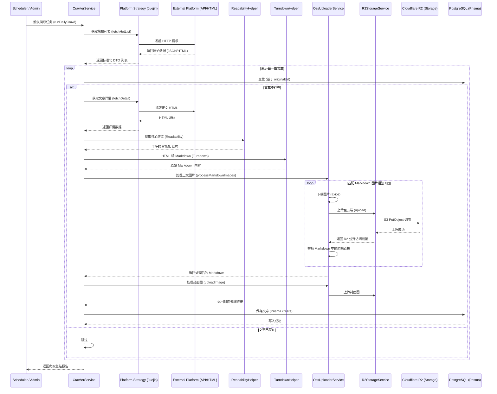

# 内容爬取与媒体云端转储全流程指南

## 1. 业务概述
为了确保博客内容的持久化显示并规避外部图片防盗链风险，系统实现了一套自动化的内容爬取与媒体转储机制。该流程将外部平台（如掘金）的文章数据结构化，并将其中的图片资产自动迁移至 **Cloudflare R2** 云存储。

---

## 2. 系统时序图 (Sequence Diagram)

---

## 3. 核心步骤详解

### 3.1 列表抓取与去重
- **Strategy 模式**：系统根据平台（Platform）调用不同的策略类。例如，掘金通过官方 API 获取 JSON。
- **原子化去重**：在深入抓取详情前，先根据 `originalUrl` 在数据库中进行唯一性校验，避免重复抓取和资源浪费。

### 3.2 内容结构化 (M2 核心)
- **Readability**：模拟浏览器的“阅读模式”，自动过滤侧边栏、广告、导航等噪声，只保留文章主体。
- **Turndown**：将清理后的 HTML 转换为标准的 GFM Markdown，确保数据在不同端的通用性。

### 3.3 图片转储流水线 (关键)
- **OssUploaderService**：负责正则匹配 Markdown 中的图片链接。
- **R2StorageService**：
    - 采用 **S3 协议** 与 Cloudflare R2 通信。
    - **R2 优先策略**：若配置了云端凭证，则上传至云端；否则自动降级到本地 `public/uploads` 目录。
    - **路径生成**：生成的路径格式为 `crawler/${uuid}.${ext}`，确保文件名全局唯一且不冲突。

### 3.4 封面图回退机制
- 若原始平台未提供封面图，`CrawlerService` 会调用 `OssUploaderService.extractFirstImage()` 尝试从处理后的 Markdown 正文中提取第一张图片作为文章封面。

---

## 4. 技术栈参考
- **Crawler**: NestJS + Puppeteer + Axios
- **Parser**: @mozilla/readability + Turndown
- **Cloud Storage**: Cloudflare R2 (@aws-sdk/client-s3)
- **Database**: PostgreSQL + Prisma

---

## 5. 常见问题排查 (Troubleshooting)
- **图片无法上传**：检查 `.env` 中的 `R2_ENDPOINT` 是否包含了 Bucket 名称（应为 API 根地址，不含 Bucket 名）。
- **图片 403**：检查 Cloudflare 控制台中 **Public Development URL** 是否已开启。
- **爬取超时**：建议在 `fetchDetail` 中增加超时时间或调整网络重试逻辑。
