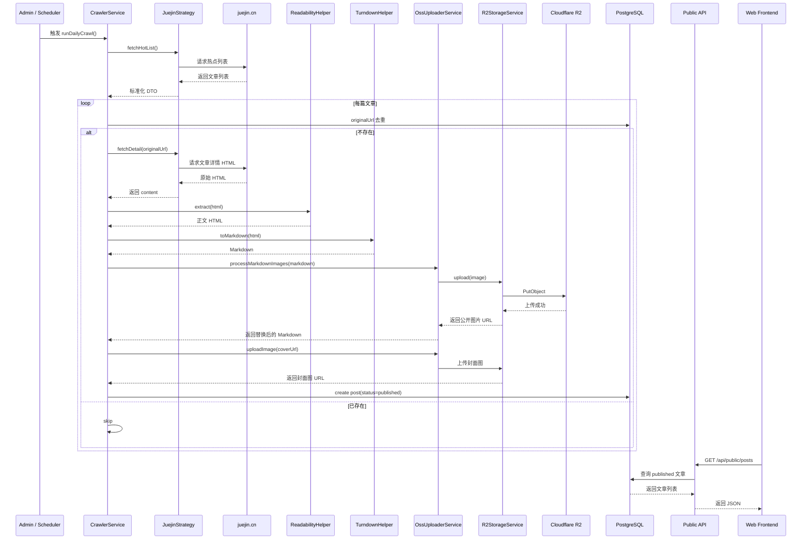

# 掘金文章抓取与线上展示实施方案

## 1. 需求目标

通过爬取掘金热点文章，获取结构化的文章数据与图片资源，并将其写入线上博客系统，使最终用户可以在博客页面看到：

- 文章标题
- 摘要
- 发布时间
- 封面图
- 正文内容
- 正文中的图片

本方案的最终目标是打通如下完整链路：

`掘金 -> 爬虫抓取 -> 正文提取 -> Markdown 转换 -> 图片上传 R2 -> 数据入库 -> 发布 -> 前台展示`

---

## 2. 业务边界

### 2.1 本次纳入范围

- 抓取掘金热点文章列表
- 抓取文章详情页 HTML
- 提取正文结构化内容
- 将正文和封面图上传到 Cloudflare R2
- 将文章保存到 PostgreSQL
- 文章状态直接设为 `published`
- 前端通过线上 API 渲染文章列表与详情页

### 2.2 本次不纳入范围

- 多平台抓取扩展
- 复杂标签映射和分类自动归档
- 自动审核和内容风控流程
- 批量回填旧文章图片

---

## 3. 架构设计

### 3.1 关键组件

- **JuejinStrategy**
  - 职责：抓取掘金热点列表和文章详情
  - 代码位置：[juejin.strategy.ts](file:///Users/wares/Desktop/Blog/apps/api/src/modules/crawler/strategies/juejin.strategy.ts)

- **CrawlerService**
  - 职责：编排抓取、去重、正文处理、图片转储、入库发布
  - 代码位置：[crawler.service.ts](file:///Users/wares/Desktop/Blog/apps/api/src/modules/crawler/crawler.service.ts)

- **ReadabilityHelper**
  - 职责：从原始 HTML 中提取正文主体
  - 代码位置：[readability.helper.ts](file:///Users/wares/Desktop/Blog/apps/api/src/modules/crawler/transformers/readability.helper.ts)

- **TurndownHelper**
  - 职责：将正文 HTML 转换为 Markdown
  - 代码位置：[turndown.helper.ts](file:///Users/wares/Desktop/Blog/apps/api/src/modules/crawler/transformers/turndown.helper.ts)

- **OssUploaderService**
  - 职责：扫描 Markdown 中的图片并替换为云端地址
  - 代码位置：[oss-uploader.service.ts](file:///Users/wares/Desktop/Blog/apps/api/src/modules/crawler/transformers/oss-uploader.service.ts)

- **R2StorageService**
  - 职责：负责 Cloudflare R2 上传
  - 代码位置：[r2-storage.service.ts](file:///Users/wares/Desktop/Blog/apps/api/src/modules/crawler/transformers/r2-storage.service.ts)

- **PublicController**
  - 职责：向前端提供已发布文章列表与详情接口
  - 代码位置：[public.controller.ts](file:///Users/wares/Desktop/Blog/apps/api/src/modules/public/public.controller.ts)

---

## 4. 端到端时序图



---

## 5. 数据模型要求

为了支撑爬虫文章的可追踪与展示，`Post` 模型必须包含以下字段：

- `title`
- `excerpt`
- `contentMarkdown`
- `coverUrl`
- `originalUrl`
- `canonicalUrl`
- `externalId`
- `platform`
- `status`
- `publishedAt`
- `sourceType`

其中：

- `originalUrl`：用于去重
- `platform`：标识来源平台，当前为 `juejin`
- `status`：必须写入为 `published`
- `sourceType`：建议标识为 `crawler`

数据模型定义位于 [schema.prisma](file:///Users/wares/Desktop/Blog/apps/api/prisma/schema.prisma)。

---

## 6. 实施步骤

### 6.1 后端抓取能力部署

确保后端已部署以下能力：

- `CrawlerModule` 已注册
- `AdminController` 可调用 `CrawlerService`
- 数据库结构已同步
- R2 凭证已配置

### 6.2 掘金文章处理流程

#### 步骤 1：抓取热点列表

- 使用掘金推荐接口获取热点文章
- 提取标题、简介、封面、发布时间、作者、标签、文章 URL

#### 步骤 2：详情页抓取

- 请求掘金文章详情页 HTML
- 使用 Readability 提取正文主体

#### 步骤 3：正文转换

- 将正文 HTML 转换为 Markdown
- 保证前端详情页可以统一使用 Markdown 渲染链路

#### 步骤 4：图片上云

- 扫描 Markdown 内图片地址
- 下载原图
- 上传至 Cloudflare R2
- 用 R2 地址替换 Markdown 原图地址
- 对封面图执行同样逻辑

#### 步骤 5：文章入库与发布

- 按 `originalUrl` 去重
- 将文章写入数据库
- 状态设为 `published`
- 记录 `publishedAt`

#### 步骤 6：前端展示

- 前端通过 `VITE_API_BASE_URL` 请求公开接口
- 列表页渲染封面图和文章摘要
- 详情页渲染 Markdown 转换后的正文

---

## 7. 环境变量方案

### 7.1 后端 Railway

```bash
DATABASE_URL=postgresql://...
PORT=4000
ADMIN_TOKEN=请设置强随机字符串

R2_ACCESS_KEY_ID=...
R2_ACCESS_KEY_SECRET=...
R2_BUCKET_NAME=wares-blog
R2_ENDPOINT=https://4722b20b2c8c393aa03020db90ed120c.r2.cloudflarestorage.com
R2_PUBLIC_URL=https://pub-0cac9c694bb64a50a001893415460066.r2.dev
```

### 7.2 前端部署平台

```bash
VITE_API_BASE_URL=https://wonderful-spontaneity-production-3251.up.railway.app
```

---

## 8. 关键风险与治理

### 8.1 前端请求错后端

风险：

- 前端请求 `www.waresblog.xyz/api/*`
- 实际返回前端 HTML，而不是后端 JSON

治理：

- 强制配置 `VITE_API_BASE_URL`
- 不依赖当前域名相对路径

### 8.2 图片未展示

风险：

- 图片仍为外链
- 图片上传 R2 失败
- R2 Public URL 不可访问

治理：

- 图片统一转储
- 抓取后检查 `coverUrl`
- 验证 `R2_PUBLIC_URL`

### 8.3 抓取成功但文章不显示

风险：

- 文章状态仍为 `draft`

治理：

- 抓取入库时直接设为 `published`

### 8.4 多环境数据混淆

风险：

- 本地触发抓取，线上页面看不到

治理：

- 所有验收必须基于线上后端地址执行

---

## 9. 验收标准

满足以下全部条件，视为方案落地成功：

- 线上后端接口可返回掘金抓取文章
- 新文章 `status = published`
- 列表页能看到封面图
- 详情页能看到正文内容
- 正文图片为 R2 地址
- 前端不再请求错误的本地域名或静态域名 `/api/*`

---

## 10. 线上执行命令

### 10.1 手动触发抓取

```bash
curl -X POST 'https://wonderful-spontaneity-production-3251.up.railway.app/api/admin/crawler/run' \
  -H 'x-admin-token: 你的ADMIN_TOKEN'
```

### 10.2 查看公开文章列表

```bash
curl 'https://wonderful-spontaneity-production-3251.up.railway.app/api/public/posts?page=1&pageSize=10'
```

---

## 11. 建议的后续演进

- 增加抓取任务运行日志与失败告警
- 增加图片上传重试机制
- 增加抓取结果统计面板
- 增加平台级开关，支持按平台启停抓取
- 增加内容审核与自动分类能力
